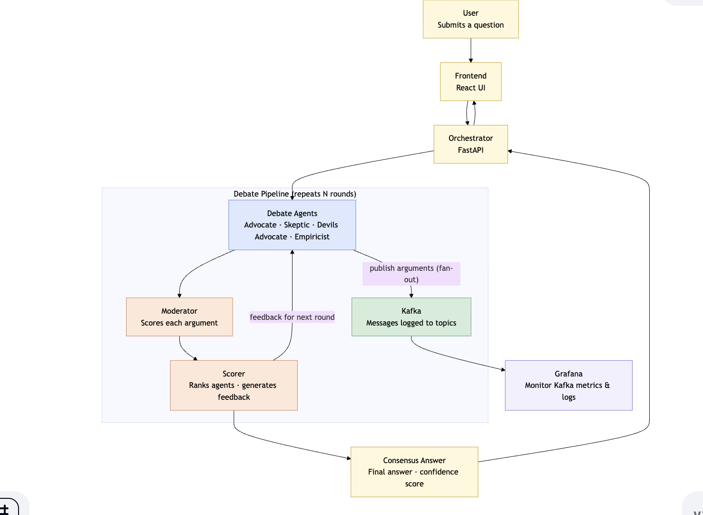
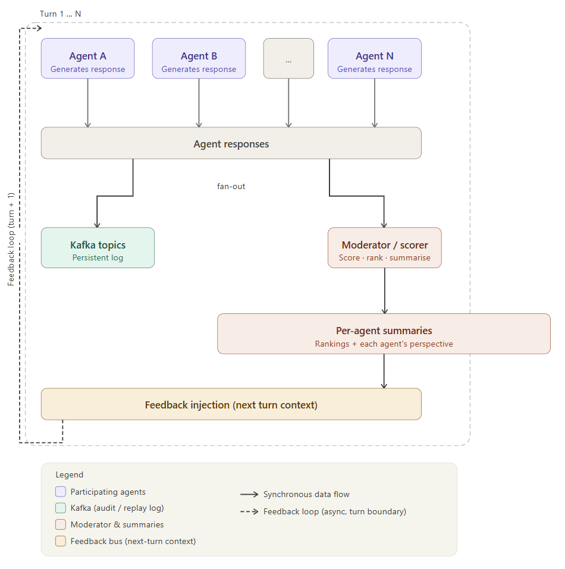

# **Demo video:** [Watch on YouTube](https://youtu.be/druNQJ4TGB0)
# **Live deployment:** [argue-41ud0zg50-matthewt12395s-projects.vercel.app](https://argue-41ud0zg50-matthewt12395s-projects.vercel.app/)

# ArgueNet

Multi-agent debate system built with LangChain and OpenRouter-backed models.

## Architecture





## Setup

```bash
python -m pip install -r requirements.txt

export OPENROUTER_API_KEY="..."
export OPENROUTER_BASE_URL="https://openrouter.ai/api/v1"
export ARGUENET_MODEL="openai/gpt-4o-mini"
export TAVILY_API_KEY="..."
export REDDIT_CLIENT_ID="..."
export REDDIT_CLIENT_SECRET="..."
export REDDIT_USER_AGENT="arguenet"
```

## Run (CLI — direct mode)

```bash
python -m arguenet.main "Should remote work be default for software teams?"
```

The debate entry point is [arguenet/main.py](arguenet/main.py).

---

## Web UI (orchestrator + React frontend)

The demo UI talks to a **FastAPI orchestrator** that runs the same pipeline as `python -m arguenet.main` (in-process). **Kafka is not required** for this path.

### Install dependencies

From the repository root:

```bash
python -m pip install -r requirements.txt
python -m pip install -r orchestrator/requirements.txt
cd frontend && npm install && cd ..
```

### Environment variables

Configure the same keys your team uses for the CLI (see **Setup** above). `arguenet` loads a `.env` file in the project root when present.

Optional tuning:

| Variable | Purpose |
|----------|---------|
| `ARGUENET_MAX_ROUNDS` | Default max rounds if the UI does not override (the UI can send `max_rounds` per request). |

On **Windows (PowerShell)** you can set variables for the current session:

```powershell
$env:OPENROUTER_API_KEY = "..."
$env:TAVILY_API_KEY = "..."
```

### Run everything (two terminals)

**Terminal 1 — orchestrator** (from repo root):

```bash
uvicorn orchestrator.app:app --reload --host 127.0.0.1 --port 8000
```

**Terminal 2 — frontend**:

```bash
cd frontend
npm run dev
```

Open **http://localhost:5173** in the browser. The Vite dev server proxies `/debate`, `/debates`, and `/health` to `http://127.0.0.1:8000`.

If the API runs on another host or port, set `VITE_API_BASE` (e.g. `VITE_API_BASE=http://127.0.0.1:8000`) when building or running the frontend.

### Demo login

The login screen is **frontend-only** for now: use **any password**. Leave the username blank to get a random guest name. Session is stored in `sessionStorage` for the tab.

### Orchestrator HTTP API (summary)

| Method | Path | Purpose |
|--------|------|---------|
| `GET` | `/health` | Liveness |
| `POST` | `/debate` | Run a full debate (blocking JSON response) |
| `POST` | `/debate/stream` | NDJSON stream: stdout-style **live rounds** log, then final `result` |
| `GET` | `/debates` | List saved debates (in-memory for this process) |
| `GET` | `/debate/{debate_id}` | Fetch one debate |

Restarting the orchestrator clears in-memory stored debates. The frontend also ships **mock “past runs”** (labeled **Demo**) so the nav is usable before you accumulate real runs.

### Deploy backend to Render (free tier)

This repo includes a ready-to-use Render blueprint at `render.yaml` that creates two services:
- `arguenet-orchestrator` — FastAPI backend
- `arguenet-loki-bridge` — background worker that forwards Kafka messages to Grafana Cloud Loki

1. Push this repo to GitHub.
2. In Render: **New +** → **Blueprint** → select this repo.
3. Render will detect `render.yaml` and create both services automatically.
4. In Render → `arguenet-orchestrator` → **Environment**, add:

   | Variable | Value |
   |----------|-------|
   | `OPENROUTER_API_KEY` | your OpenRouter key |
   | `TAVILY_API_KEY` | your Tavily key |
   | `REDDIT_CLIENT_ID` | your Reddit client ID |
   | `REDDIT_CLIENT_SECRET` | your Reddit client secret |
   | `REDDIT_USER_AGENT` | `arguenet` |
   | `KAFKA_BOOTSTRAP_SERVERS` | `pkc-rgm37.us-west-2.aws.confluent.cloud:9092` |
   | `KAFKA_SASL_KEY` | Confluent Cloud cluster API key |
   | `KAFKA_SASL_SECRET` | Confluent Cloud cluster API secret |

5. In Render → `arguenet-loki-bridge` → **Environment**, add:

   | Variable | Value |
   |----------|-------|
   | `KAFKA_BOOTSTRAP_SERVERS` | `pkc-rgm37.us-west-2.aws.confluent.cloud:9092` |
   | `KAFKA_SASL_KEY` | Confluent Cloud cluster API key |
   | `KAFKA_SASL_SECRET` | Confluent Cloud cluster API secret |
   | `GRAFANA_LOKI_URL` | `https://logs-prod-021.grafana.net` |
   | `GRAFANA_LOKI_USER` | Grafana Cloud Loki user ID |
   | `GRAFANA_API_TOKEN` | Grafana Cloud Access Policy token (with `logs:write` scope) |

6. Deploy and verify:
   - `https://<your-render-service>.onrender.com/health` returns `{"status":"ok",...}`
   - Render logs for `arguenet-loki-bridge` show `Kafka→Loki bridge started`

Then point your Vercel frontend at Render:

- Set `VITE_API_BASE=https://<your-render-service>.onrender.com` in Vercel project env vars.
- Redeploy Vercel frontend.

---

## Kafka Messaging Layer

The Kafka layer replaces direct Python function calls between agents with
async message passing over three Kafka topics. Each agent publishes its
output to Kafka and the coordinator collects responses before advancing
to the next phase.

### Kafka broker

**Production (Render / cloud):** [Confluent Cloud](https://confluent.cloud) — fully managed, no local Kafka needed. Topics are auto-created by the orchestrator on startup with `replication_factor=3`.

**Local development:** Kafka via Homebrew (see Prerequisites below). Topics must be created manually.

### Topics

| Topic | Direction | Purpose |
|---|---|---|
| `arguenet.debate.control` | coordinator → agents | Phase signals (argue, score, rebut, terminate) |
| `arguenet.debate.arguments` | debate agents → coordinator | Arguments and counterarguments |
| `arguenet.debate.evaluations` | moderator → coordinator | Moderator scores per agent |
| `arguenet.debate.dlq` | any → DLQ | Malformed or failed messages |

### Round lifecycle

```
coordinator → control(argue)
    debate agents invoke LLMs concurrently → publish to arguments topic

coordinator → control(score)
    moderator invokes LLM → publish scores to evaluations topic

coordinator → control(rebut)
    debate agents rebut using moderator feedback → publish to arguments topic

coordinator scores rebuttals → termination check → loop or stop
```

### Message schema

Every Kafka message is wrapped in a `MessageEnvelope`:

```json
{
  "message_id": "<uuid>",
  "debate_id": "<uuid>",
  "round_number": 1,
  "message_type": "argument | counterargument | evaluation | control",
  "sender_id": "advocate | skeptic | devils_advocate | empiricist | moderator | coordinator",
  "target_ids": [],
  "timestamp": "2026-04-19T00:00:00+00:00",
  "payload": {}
}
```

`payload` holds a serialised `Argument`, `ModeratorScore`, or `ControlPayload`
depending on `message_type`.

### Prerequisites

**Option A — Confluent Cloud (recommended for production and Render):**

1. Create a free cluster at [confluent.cloud](https://confluent.cloud)
2. Generate a cluster API key (Kafka → API Keys)
3. Set env vars — topics are auto-created by the orchestrator on first run:

```bash
export KAFKA_BOOTSTRAP_SERVERS="<your-cluster>.confluent.cloud:9092"
export KAFKA_SASL_KEY="<api-key>"
export KAFKA_SASL_SECRET="<api-secret>"
```

**Option B — Local Kafka via Homebrew (Mac, dev only):**

```bash
brew install kafka
brew services start kafka
```

Create topics manually (one-time):

```bash
kafka-topics --bootstrap-server localhost:9092 \
  --create --topic arguenet.debate.control --partitions 1 --replication-factor 1
kafka-topics --bootstrap-server localhost:9092 \
  --create --topic arguenet.debate.arguments --partitions 1 --replication-factor 1
kafka-topics --bootstrap-server localhost:9092 \
  --create --topic arguenet.debate.evaluations --partitions 1 --replication-factor 1
kafka-topics --bootstrap-server localhost:9092 \
  --create --topic arguenet.debate.dlq --partitions 1 --replication-factor 1
```

### Run (Kafka mode)

```bash
export TAVILY_API_KEY="tvly-..."
export KAFKA_BOOTSTRAP_SERVERS="localhost:9092"   # or Confluent Cloud URL
export ARGUENET_MODEL="openai/gpt-4o-mini"
export ARGUENET_MAX_ROUNDS="2"                    # fewer rounds = faster + cheaper

python -m arguenet.kafka_main "Should remote work be default for software teams?"
```

### Smoke test (no API keys needed)

Verifies Kafka topics and producer/consumer wiring before spending API credits:

```bash
python3 -c "
from arguenet.messaging.producer import ArgueNetProducer
from arguenet.messaging.consumer import ArgueNetConsumer
from arguenet.messaging.schema import MessageEnvelope
from arguenet.messaging.topics import ARGUMENTS_TOPIC
import time, uuid

debate_id = 'test-' + str(uuid.uuid4())[:8]
group_id  = 'test-group-' + str(uuid.uuid4())[:8]

consumer = ArgueNetConsumer([ARGUMENTS_TOPIC], group_id, auto_offset_reset='latest')
consumer.poll(timeout_ms=5000)   # warmup — forces partition assignment

with ArgueNetProducer() as p:
    msg = MessageEnvelope(
        debate_id=debate_id, round_number=1,
        message_type='argument', sender_id='advocate',
        payload={'test': True}
    )
    p.send(ARGUMENTS_TOPIC, msg)
    print('sent:', msg.message_id)

msgs = consumer.poll(timeout_ms=5000, debate_id=debate_id)
print('received:', len(msgs), 'message(s)')
for m in msgs:
    print(' -', m.sender_id, m.message_type, m.payload)
consumer.close()
"
```

Expected output:
```
sent: <uuid>
received: 1 message(s)
 - advocate argument {'test': True}
```

### Watch live traffic

Open extra terminal tabs before running a debate to see messages flow in real time:

```bash
# arguments topic
kafka-console-consumer --bootstrap-server localhost:9092 \
  --topic arguenet.debate.arguments --from-beginning

# control signals
kafka-console-consumer --bootstrap-server localhost:9092 \
  --topic arguenet.debate.control --from-beginning
```

### Grafana Cloud monitoring

ArgueNet ships a monitoring stack that pushes Kafka message logs to **Grafana Cloud Loki** and Kafka broker metrics via the **Confluent Cloud integration**.

| Component | What it does |
|-----------|-------------|
| `monitoring/kafka_loki_bridge.py` | Reads every Kafka message and pushes it to Grafana Cloud Loki with labels: `app`, `topic`, `agent`, `message_type`, `debate_id`, `trace_id` |
| Confluent Cloud → Grafana integration | Managed scrape job — no local Prometheus needed |

**Useful Loki queries in Grafana Explore:**

```
# All debate messages
{app="arguenet"}

# Filter by message type
{app="arguenet", message_type="argument"}
{app="arguenet", message_type="evaluation"}

# Trace a single debate end-to-end
{app="arguenet", trace_id="<first-8-chars-of-trace-id>"}

# Filter by agent
{app="arguenet", agent="advocate"}
```

**Run the bridge locally:**

```bash
set -a && source monitoring/grafana_cloud.env && set +a
bash monitoring/start_monitoring.sh
```

On Render, the `arguenet-loki-bridge` worker runs automatically — no local bridge needed.

### Messaging layer files

```
arguenet/messaging/
    schema.py      # MessageEnvelope, ControlPayload, MessageType, Phase
    topics.py      # Topic constants and per-role routing table
    producer.py    # ArgueNetProducer (confluent-kafka wrapper)
    consumer.py    # ArgueNetConsumer (confluent-kafka wrapper)
    router.py      # message_type_for_phase(), agents_for_phase(), rebuttal_targets()

arguenet/kafka_main.py   # Kafka-driven debate runner
```

> **Note:** The Kafka layer requires `confluent-kafka` (listed in `requirements.txt`).
> `confluent-kafka` 2.x requires `"group.protocol": "classic"` when connecting to
> Kafka 4.x, which is already configured in `arguenet/messaging/consumer.py`.


